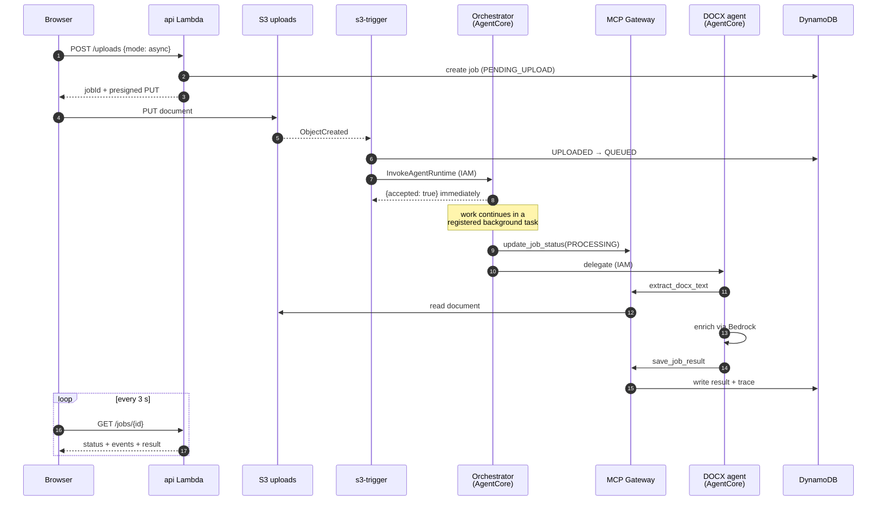
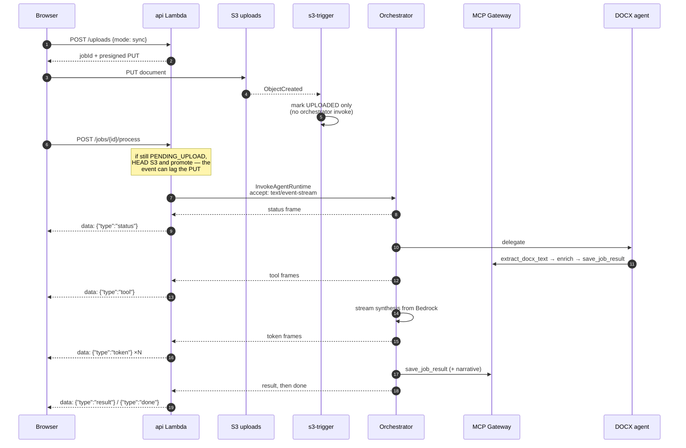
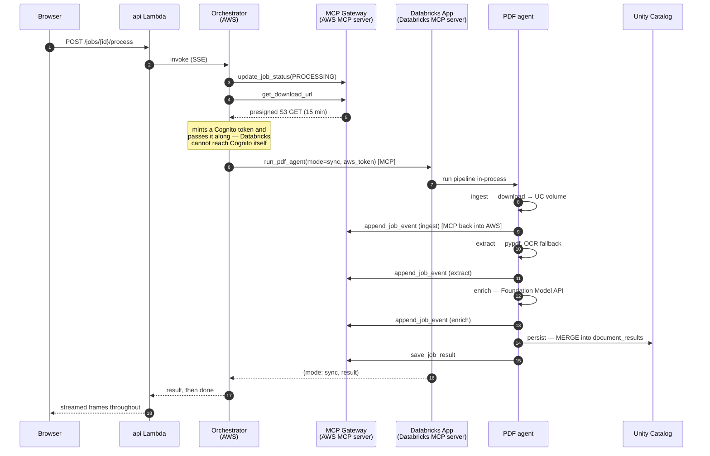
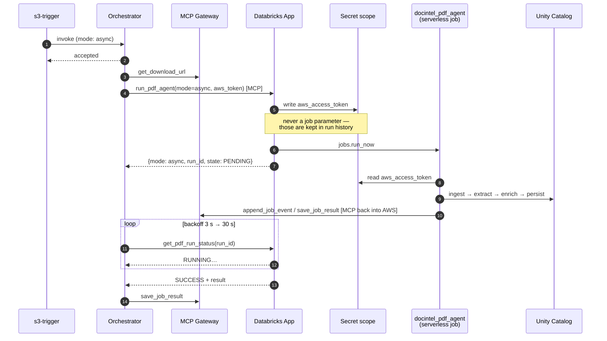
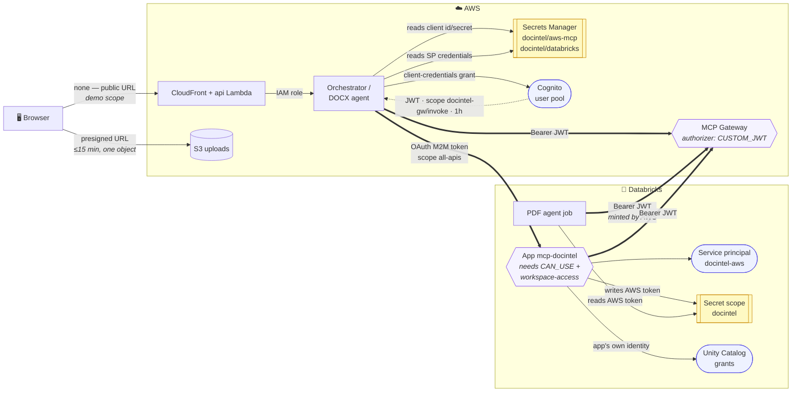

# How a document is processed: sync vs async, DOCX vs PDF

Two independent choices decide what happens to an upload:

| Choice | Decided by | Effect |
|---|---|---|
| **Which cloud does the work** | the **document type** | DOCX stays entirely inside AWS. PDF is processed in Databricks. |
| **How you observe it** | the **mode** you pick | `sync` streams progress live over SSE. `async` returns immediately and you poll. |

They are orthogonal: the same agents and the same tools run either way. Mode changes *who waits*
and *how you find out*, not what executes. That is the single most common misunderstanding, so
the UI states it explicitly next to the mode selector.

Measured end-to-end times on the deployed stack (two-page documents):

| | DOCX | PDF |
|---|---|---|
| sync | ~20 s | ~25 s |
| async | ~30 s | ~60 s (serverless job start dominates) |

---

## The pieces

| Component | Where | Role |
|---|---|---|
| `api` Lambda | AWS | REST + SSE. Function URL in `RESPONSE_STREAM` mode, fronted by CloudFront |
| `s3-trigger` Lambda | AWS | Fires on `ObjectCreated`, marks the job uploaded, queues async work |
| **Orchestrator** | AWS, AgentCore Runtime | Decides the route, drives the job, streams events |
| **DOCX agent** | AWS, AgentCore Runtime | Extracts and enriches DOCX |
| **AgentCore Gateway** | AWS | **MCP server** — 7 job tools, Cognito JWT auth, Lambda target |
| **Databricks App** | Databricks | **MCP server** — 8 tools, plus the PDF agent in-process |
| `docintel_pdf_agent` | Databricks | Serverless job running the same PDF agent for async |
| DynamoDB / S3 / UC table | both | Job state + trace / documents + result JSON / structured PDF results |

Every job mutation goes through an MCP tool, so the trace you see in the UI is the literal record
of tool calls that crossed the boundary.

---

## 1. DOCX + async — the brief's primary path

Nothing leaves AWS. The upload event itself starts the work; the browser is not involved after
the PUT.

**Why the orchestrator returns before finishing:** AgentCore invocations are request/response, so
a long job would hit the caller's timeout. It registers a background task, answers `accepted`,
and keeps working; the job record is the source of truth the UI polls.

---

## 2. DOCX + sync — same work, watched live

The S3 trigger deliberately does **not** start processing for a sync job: the browser does, so it
can hold the stream.

**Race handled on purpose:** the browser can call `/process` before S3's notification has fired.
Rather than fail, the API checks whether the object exists and promotes the job itself.

---

## 3. PDF + sync — crossing into Databricks and back

The only path where two clouds are active at once, and the clearest demonstration of the brief.

**The step that proves the assignment:** every `append_job_event` / `save_job_result` above is an
agent *running in Databricks* calling an *MCP server in AWS*, authenticated with a short-lived
Cognito token. The reverse direction — AWS calling the Databricks MCP server — is the
`run_pdf_agent` call, authenticated with an OAuth service principal.

---

## 4. PDF + async — the serverless job

Same pipeline, but the App triggers a Databricks job instead of running it, and the orchestrator
polls for the outcome.

**Why the token goes through the secret scope:** Databricks stores job parameters in run history
and displays them in the UI, so passing a live bearer token as a parameter would leave a working
credential in a log. The App writes it to the `docintel` secret scope instead, where it is
redacted, and the job reads it back like any other secret.

---

## 5. Authentication — who proves what, to whom

Every hop above crosses a trust boundary, and each uses a different mechanism. **No static
long-lived credential exists anywhere in the system**: there are no AWS access keys in
Databricks and no Databricks personal access token in AWS.

### Each boundary

| # | Hop | Mechanism | Lifetime | Why this one |
|---|---|---|---|---|
| 1 | Browser → API | **none** | — | Out of scope for the demo (PLAN §2.5). Mitigated by a reserved-concurrency cap. A shared-secret header or Cognito login is the obvious next step. |
| 2 | Browser → S3 | **presigned URL** | ≤ 15 min | The browser never gets S3 credentials, only a capability for one object and one verb. |
| 3 | Lambda → AgentCore | **IAM** | request-scoped | `bedrock-agentcore:InvokeAgentRuntime` granted to that function's role only. |
| 4 | AWS agent → **AWS MCP Gateway** | **Cognito client-credentials JWT** | 1 h | The Gateway's authorizer is `CUSTOM_JWT` pinned to one app client and the scope `docintel-gw/invoke`. No token, no tools. |
| 5 | AWS → **Databricks MCP server** | **OAuth M2M** (service principal `docintel-aws`) | 1 h | Client id/secret held in Secrets Manager; the SP additionally needs `CAN_USE` on the app **and** the `workspace-access` entitlement. |
| 6 | Databricks agent → **AWS MCP Gateway** | the **same Cognito JWT**, minted by AWS and passed in | 1 h | Databricks serverless resolves DNS through an allowlist that excludes the Cognito endpoint, so it cannot mint its own. Sync receives it in the request body; async reads it from the secret scope. |
| 7 | App/job → Unity Catalog | **the app's own service principal** | — | A separate identity from `docintel-aws`, with `USE CATALOG` / `USE SCHEMA` / `SELECT` / `MODIFY` / `CREATE TABLE` and volume read+write. |

### Where secrets live

| Store | Holds | Read by |
|---|---|---|
| AWS Secrets Manager `docintel/aws-mcp` | Cognito token URL, client id + secret, scope, gateway URL | orchestrator, DOCX agent |
| AWS Secrets Manager `docintel/databricks` | Databricks host, SP client id + secret, MCP URL, job id | orchestrator |
| Databricks secret scope `docintel` | the same AWS gateway credentials, plus the short-lived `aws_access_token` | the App and the PDF agent job |

The Cognito app-client secret is never rendered into the CloudFormation template: CDK resolves it
through a describe call at deploy time, and the feature flag that would log it is explicitly
disabled.

### Token lifecycle gotchas found live

- **Databricks answers an expired bearer with `403 PermissionDeniedError`, not `401`.** Code that
  refreshed only on `AuthenticationError` never fired, so enrichment broke about an hour after
  each app start. Tokens are now resolved per call, with the retry catching both shapes.
- **A new service principal has no entitlements.** Its OAuth token is valid and correctly scoped,
  yet every call to the App returns `401` until `workspace-access` is granted — with nothing in
  the error pointing at the cause.
- **Job parameters are stored in run history and shown in the UI**, so a bearer token must never
  be one. The App writes it to the secret scope instead.

---

## What differs, side by side

| | DOCX sync | DOCX async | PDF sync | PDF async |
|---|---|---|---|---|
| Who starts the work | browser (`/process`) | S3 event | browser | S3 event |
| Processing cloud | AWS | AWS | Databricks | Databricks |
| Databricks compute | — | — | the App | serverless job |
| Progress delivery | SSE stream | polling | SSE stream | polling |
| Cross-cloud MCP calls | no | no | yes, both directions | yes, both directions |
| Result written to | DynamoDB + S3 | DynamoDB + S3 | + Unity Catalog | + Unity Catalog |
| Typical duration | ~20 s | ~30 s | ~25 s | ~60 s |

## Failure behaviour

- Any step failing marks the job `FAILED` with the reason, and sync streams an `error` frame
  followed by `done` — `done` is always last, so a client never waits forever.
- The Databricks agent reports `FAILED` back to AWS through the Gateway, so a failure inside
  Databricks still surfaces in the AWS job record and the UI.
- If a sync stream drops, the job keeps running; the UI re-fetches `GET /jobs/{id}` and shows the
  outcome. Nothing depends on the browser staying connected.
- A PDF submitted before Databricks is configured returns a clear "not configured yet" message
  rather than a transport error, because the Databricks connection is opened lazily.
