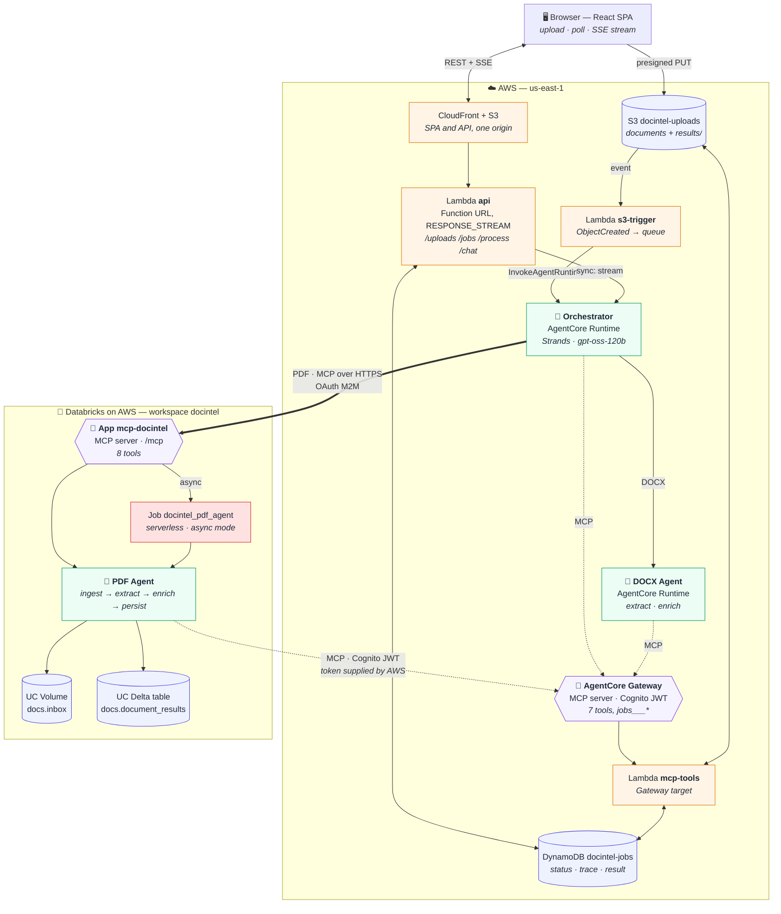

# DocIntel – Project Plan

Cross-cloud, agentic document-intelligence demo spanning **AWS** and **Databricks**, with **MCP servers on both clouds** and **MCP tool calls from agents on both clouds**.

> Source brief: `/home/narenthiranj/dev/technium/assessment/assignment.md`
> Working repo: `/home/narenthiranj/dev/assignment`
> Author: Nari (Naren's AI agent) · Plan date: 2026-09-23 · Last updated: 2026-09-23 (region us-east-1, TypeScript Lambdas, model gpt-oss-120b)

---

## 0. Deployed environment (verified live 2026-09-24)

Both paths are running end to end. This section records what was actually provisioned and the
environment-specific constraints discovered while deploying; §1-§8 describe the design.

| | |
|---|---|
| Web UI (and API, same origin) | https://d3fhr1wqlh1ql9.cloudfront.net |
| AWS account / region | `<AWS_ACCOUNT_ID>` / `us-east-1` |
| AWS MCP server (AgentCore Gateway) | 7 tools, exposed as `jobs___<tool>` |
| AgentCore runtimes | `docintel_orchestrator`, `docintel_docx_agent` (zip deploy, arm64) |
| Bedrock model | `openai.gpt-oss-120b-1:0` |
| Databricks workspace | `https://dbc-34766815-3348.cloud.databricks.com` (AWS) |
| Databricks MCP server | Databricks App `mcp-docintel`, 8 tools |
| Catalog / schema / table | `workspace.docs.document_results` (Default Storage workspace: the built-in `workspace` catalog is used; a new catalog needs a MANAGED LOCATION) |
| Volume | `/Volumes/workspace/docs/inbox` |
| SQL warehouse / FM endpoint | `63ea130ae37ddbb9` / `databricks-gpt-oss-120b` |

**Verified:** DOCX async and PDF sync both complete; both MCP servers list and call each other's
tools across clouds; SSE streams the contracted `status`/`tool`/`token`/`result`/`done` frames;
results land in DynamoDB, `results/{jobId}/result.json` in S3, and the Unity Catalog table.

### 0.1 Environment constraints that shaped the implementation

1. **Databricks serverless resolves DNS through an allowlist.** S3, the AgentCore Gateway and
   PyPI resolve; the **Cognito token endpoint does not** (nor does e.g. `google.com`). The
   Databricks side therefore cannot mint its own AWS token: the orchestrator passes one in.
   For the async job the token is written to the `docintel` **secret scope** (never a job
   parameter - those are stored in run history and shown in the UI); the sync path receives it
   in the TLS request body.
2. **The app must not be pip-installed.** `pip install .` caches the wheel by version, and with
   a static version the app kept serving stale code. `PYTHONPATH=/app/python/source_code/src`
   in `app.yaml` makes the synced source authoritative.
3. **`app.yaml` uses camelCase `valueFrom`.** The DAB schema's snake_case `value_from` is
   silently ignored there, yielding empty env vars. A bundle `resources.apps.<app>.env` block
   never reached the deployed app *and* replaced `app.yaml`'s env, so all app env lives in
   `app.yaml`.
4. **Three distinct identities need grants**: the AWS-side SP (`docintel-aws`), the app's own
   SP, and the user. A new SP has **no entitlements** - without `workspace-access` every call to
   the app returns 401 with no hint. The app also needs run rights on the job it triggers.
5. **The serverless job runs with no `__file__` and inside an existing event loop**, so the
   entry point resolves its path from the working directory and detects a running loop.
6. **Gateway tools are prefixed** `jobs___<tool>`; both clouds' clients add the prefix.
7. **The API is served through CloudFront**, not its Lambda Function URL: some upstream DNS
   resolvers refuse `*.lambda-url.*.on.aws`, and one origin also removes CORS entirely.
8. **Workspace layout.** This project's files deploy to `/Workspace/Shared/docintel/<target>`
   (set via `workspace.root_path`) rather than the default `/Users/<you>/.bundle/...`, so they
   are findable and not mixed into a personal home folder. The UUID-named folders under
   `Users/` are **not ours**: Databricks creates a home folder per service principal named by
   its application id (`341d68ba-…` is the App's own identity, `7ae75d6b-…` is `docintel-aws`),
   and the `src/<id>` folders inside are per-deployment source snapshots the Apps platform
   writes. Neither can be renamed; old snapshots can be pruned, keeping the active one.
9. **Terraform is a prerequisite for the Databricks half.** Asset Bundles drive Terraform
   internally and the CLI's own download fails on HashiCorp's expired signing key, so a local
   binary is required (`make prereqs` checks for it; README has the install command). The CLI
   also refuses a version other than the one it pins, so `scripts/deploy-databricks.sh` reads
   the installed version and exports `DATABRICKS_TF_VERSION` to match — any recent Terraform
   works, no need to match the pin by hand.

---

## 1. Requirement analysis

| # | Requirement (from brief) | Interpretation | Design answer |
|---|---|---|---|
| R1 | AWS-hosted ReactJS chatbot frontend; upload + submit doc processing | Static React SPA, hosted in AWS | Vite + React 19 + TypeScript on **S3 + CloudFront** |
| R2 | 2-page PDF/DOCX uploaded into S3; S3 → Lambda event trigger picked up by an AI agent running in AWS | Event-driven ingestion | Presigned PUT to `docintel-uploads`, `s3:ObjectCreated` → **`s3-trigger` Lambda** → invokes the **Orchestrator agent** on **Bedrock AgentCore Runtime** |
| R3 | DOCX → summarised inside AWS by an agent in **Bedrock AgentCore** | AWS-native path | **DOCX Agent** (Strands Agents on AgentCore Runtime) does extraction + enrichment + summary using `gpt-oss-120b` on Bedrock |
| R4 | PDF → summarised inside **Databricks** by an agent running in Databricks | Databricks-native path | **PDF Agent** runs inside a **Databricks App** (sync) or a **Databricks Job** (async); OCR via `ai_parse_document`, enrichment via Foundation Model APIs (`databricks-gpt-oss-120b`) |
| R5 | AWS orchestration layer must invoke AWS agents and *securely* orchestrate agents in AWS (DOCX) and Databricks (PDF) | Orchestrator = AI agent with tools | **Orchestrator Agent** on AgentCore Runtime. AWS-to-AWS via IAM (`InvokeAgentRuntime`). AWS-to-Databricks via OAuth M2M service principal. Databricks-to-AWS via Cognito client-credentials JWT |
| R6 | MCP server setup on AWS **and** Databricks; MCP tool calls from agents on AWS **and** Databricks | Two MCP servers, both consumed cross-cloud | **AWS MCP server** = AgentCore **Gateway** (Lambda target, JWT auth). **Databricks MCP server** = custom streamable-HTTP MCP server hosted on **Databricks Apps**. AWS agents call both; the Databricks agent calls both |
| R7 | Databricks must process PDFs from a **Volume**, do OCR/text extraction + AI enrichment, and persist into a **Unity Catalog table** | UC-first data path | Volume `docintel.docs.inbox`; table `docintel.docs.document_results` (Delta); `ai_parse_document` + `pypdf`; `databricks-gpt-oss-120b` FMAPI |
| R8 | Responses sent to LLM; chatbot **streams** the response back with summary details | Real token streaming | Lambda **Function URL with response streaming** proxies AgentCore SSE to the browser |
| R9 | Use AWS backend (S3 + database) and Databricks (Volume + Table) | Storage on both sides | S3 (documents), **DynamoDB** (job state/results), UC Volume + Delta table |
| R10 | Demo E2E with **sync and async** modes; expose **job status and results** to the frontend | Both execution modes visible in UI | `mode=sync` → client-driven streaming run; `mode=async` → S3-event-driven background run + polling. `GET /jobs/{id}` exposes status, agent trace, and results |

### Out of scope / explicitly simplified for the demo
- End-user login (Cognito Hosted UI) — API is open with CORS; documented as a hardening step.
- Multi-tenant isolation, quotas, WAF.
- Large documents (>10 MB / >20 pages). The brief is scoped to 2-page documents.

---

## 2. Target architecture



**Reading the diagram.** Solid arrows are data and control flow; dotted arrows are MCP tool
calls; the thick arrow is the cross-cloud hop. The two hexagons are the MCP servers the brief
asks for — one per cloud — and both are called from agents on the *other* cloud, which is what
makes this genuinely cross-cloud rather than two pipelines side by side.

**The two document paths.** A DOCX job never leaves AWS: orchestrator → DOCX agent → Gateway
tools → DynamoDB/S3. A PDF job crosses to Databricks, is processed there against Unity Catalog,
and the Databricks agent calls *back* into the AWS Gateway to report progress and save its
result. Sync mode streams tokens to the browser throughout; async mode returns immediately and
the UI polls.

### 2.1 Component inventory

| Layer | Component | Tech | Hosting |
|---|---|---|---|
| UI | `frontend/` | Vite, React 19, TypeScript, Tailwind 4 | S3 + CloudFront |
| API | `aws/lambdas/src/api.ts` | Node 22, TypeScript, AWS SDK v3, Function URL (streaming) | Lambda |
| Ingest | `aws/lambdas/src/s3-trigger.ts` | Node 22, TypeScript, AWS SDK v3 | Lambda (S3 event) |
| AWS MCP server | AgentCore Gateway + `aws/lambdas/src/mcp-tools.ts` | Node 22, TypeScript, `mammoth` (DOCX text) | Gateway (Cognito JWT) → Lambda target |
| Orchestrator agent | `aws/agents/orchestrator` | Python 3.12, Strands Agents, bedrock-agentcore SDK, MCP client | AgentCore Runtime (zip deploy, HTTP protocol) |
| DOCX agent | `aws/agents/docx_agent` | Python 3.12, Strands Agents, bedrock-agentcore SDK | AgentCore Runtime |
| State | DynamoDB `docintel-jobs` | PAY_PER_REQUEST, TTL 7d, GSI for listing | DynamoDB |
| Secrets | `docintel/databricks`, `docintel/aws-mcp` | Secrets Manager | Secrets Manager |
| Auth (M2M) | Cognito user pool + resource server + client-credentials app client | Cognito | Cognito |
| Databricks MCP server + PDF agent | `databricks/app` | FastAPI, `mcp` 2.x `MCPServer`, databricks-sdk, pypdf | Databricks Apps |
| Async PDF agent | `databricks/jobs/pdf_agent_job.py` | Serverless job, same package | Databricks Jobs |
| Data | `docintel.docs.inbox`, `docintel.docs.document_results` | UC Volume, Delta table | Unity Catalog |
| IaC | `aws/infra` (CDK v2 TS), `databricks/databricks.yml` (Asset Bundle) | CDK 2.270+, DAB | – |

### 2.1.1 Language policy
- **TypeScript** for everything that runs on Lambda or in the browser or defines infrastructure: `api`, `s3-trigger`, `mcp-tools`, CDK, frontend. One toolchain (npm + esbuild), one shared `aws/lambdas/src/lib/` (job store, S3, SSE helpers). Lambda response streaming is Node.js-only, and the MCP tools never needed Python.
- **Python** only where the platform requires it: the two AgentCore agents (Strands Agents + bedrock-agentcore SDK) and the Databricks App/Job (databricks-sdk, `ai_parse_document`, FMAPI). They share one tiny helper package (`aws/common/docintel_common`: OAuth token helpers + SSE frame format); agents never talk to DynamoDB directly — they go through the AWS MCP tools.

### 2.2 Execution flows

> Step-by-step sequence diagrams for all four paths, plus the authentication model, are in
> [FLOWS.md](FLOWS.md). This section is the summary.


**Async (S3-event-driven, the brief's primary path)**
1. UI → `POST /uploads {fileName, contentType, mode:"async"}` → API creates job (`PENDING_UPLOAD`) → returns presigned PUT for `uploads/async/{jobId}/{fileName}`.
2. Browser PUTs the file to S3.
3. `s3-trigger` parses key → job `UPLOADED` → `QUEUED` → `InvokeAgentRuntime(orchestrator, {jobId, mode:"async"})`.
4. Orchestrator entrypoint registers a background task (AgentCore async-task pattern) and returns `{accepted:true}` immediately.
5. Background workflow (LLM-driven, tool-guided):
   - `get_job` (AWS MCP) → decides by `docType`.
   - DOCX → `delegate_to_docx_agent` (IAM `InvokeAgentRuntime` to DOCX runtime) → DOCX agent calls `extract_docx_text` + `save_job_result` (AWS MCP).
   - PDF → `get_download_url` (AWS MCP) → `run_pdf_agent(mode="async")` (Databricks MCP) → Databricks Job runs the PDF agent → agent calls its local tools (ingest → extract/OCR → enrich → persist to UC table) **and** AWS MCP tools (`update_job_status`, `save_job_result`) → orchestrator polls `get_pdf_run_status`.
   - Orchestrator writes final synthesis via `save_job_result` → `COMPLETED`.
6. UI polls `GET /jobs/{jobId}` every 3 s → status stepper, agent trace, results.
7. UI "Ask about this document" → `POST /chat` (SSE) → orchestrator `mode:"chat"` streams an answer grounded on the stored result.

**Sync (client-driven streaming)**
1–2. Same upload with `mode:"sync"` (key prefix `uploads/sync/...`); `s3-trigger` only marks `UPLOADED`.
3. UI → `POST /jobs/{jobId}/process` → API Lambda opens `InvokeAgentRuntime` with `accept: text/event-stream` and pipes SSE frames straight to the browser.
4. Orchestrator runs the same workflow but with `mode:"sync"`: DOCX path is in-process; PDF path calls `run_pdf_agent(mode="sync")`, which runs the PDF agent **inside the Databricks App** and returns in one call.
5. Stream events: `status`, `tool`, `token`, `result`, `done`. The final summary is streamed token-by-token.

### 2.3 Security model
- No public buckets; browser uses short-lived presigned URLs; CloudFront uses OAC.
- AWS→AWS: IAM only (`bedrock-agentcore:InvokeAgentRuntime`, least-privilege roles per Lambda/runtime).
- AWS MCP server (Gateway): inbound **Cognito client-credentials JWT** (`allowedClients` pinned), outbound Lambda via Gateway IAM role.
- AWS→Databricks: service-principal **OAuth M2M** (`/oidc/v1/token`), credentials in Secrets Manager; SP granted `CAN_USE` on the app + UC privileges only on `docintel.docs`.
- Databricks→AWS: Cognito client id/secret held in a **Databricks secret scope**, injected into the App/Job as env vars.
- Secrets never in code, `.env`, or bundle files; `.env.example` documents names only.

### 2.4 Data model – DynamoDB `docintel-jobs`
```
jobId (PK)        uuid
entity            "JOB" (GSI pk)        createdAt  ISO-8601 (GSI sk)  → GSI `byCreatedAt`
fileName, contentType, docType ("docx"|"pdf"), s3Key, sizeBytes
mode              "sync" | "async"
status            PENDING_UPLOAD | UPLOADED | QUEUED | PROCESSING | COMPLETED | FAILED
processor         "aws-docx-agent" | "databricks-pdf-agent"
events[]          {ts, source: aws|databricks|orchestrator, agent, tool, message}
result            {summary, keyPoints[], entities[], topics[], sentiment, language,
                   pageCount, wordCount, extractionMethod, model,
                   ucTable?, databricksRunId?, volumePath?, narrative?}
                  (narrative = orchestrator's streamed synthesis, sync mode only)
resultS3Key       results/{jobId}/result.json  (JSON copy of `result` written by save_job_result)
error, updatedAt, completedAt, ttl
```

### 2.5 Data model – Unity Catalog `docintel.docs.document_results`
```
job_id STRING, file_name STRING, source_s3_key STRING, volume_path STRING, page_count INT, word_count INT,
char_count INT, extraction_method STRING, extracted_text STRING, summary STRING,
key_points ARRAY<STRING>, entities ARRAY<STRUCT<name:STRING,type:STRING>>, topics ARRAY<STRING>,
sentiment STRING, language STRING, model STRING, run_mode STRING, run_id STRING,
processed_at TIMESTAMP
-- Delta, TBLPROPERTIES ('delta.enableChangeDataFeed' = 'true')
```

### 2.6 API contract (Lambda Function URL)
| Method & path | Body / params | Returns |
|---|---|---|
| `POST /uploads` | `{fileName, contentType, mode}` | `{jobId, uploadUrl, s3Key}` |
| `GET /jobs` | `?limit=50` | `{items:[...], nextCursor?}` newest first (list convention, DEVELOPMENT §10) |
| `GET /jobs/{jobId}` | – | job document |
| `POST /jobs/{jobId}/process` | – | **SSE** stream (sync mode run) |
| `POST /chat` | `{jobId, message, sessionId?}` — `sessionId` optional, min 33 chars (AgentCore floor); omitted by the SPA, so the server derives `{jobId}-chat` | **SSE** stream |
| `GET /health` | – | `{ok:true}` |

SSE frame format: `data: <json>\n\n`, optional `: ping\n\n` heartbeat every 15 s, `done` is always last. Consumers validate leniently (unknown extra fields allowed). Exact shapes (single source of truth for `aws/lambdas` stream-proxy, `docintel_common/events.py`, and `frontend/src/types/sse.ts`):

```
{type:"status", ts, jobId, status, message?, source?: "aws"|"databricks"|"orchestrator", agent?}
{type:"tool",   ts, jobId, name, phase:"start"|"end", source, agent?, summary?}
{type:"token",  text, ts?}
{type:"result", ts, jobId, result: JobResult}
{type:"error",  ts, jobId?, error:{code, message}}
{type:"done",   ts, jobId?}
```

`POST /jobs/{jobId}/process` accepts a job in `PENDING_UPLOAD` if the object already exists in S3 (HEAD): the API marks it `UPLOADED` (with `sizeBytes`) and proceeds, because the S3 event trigger can lag the browser's PUT by hundreds of ms. The S3 trigger is idempotent: if the job is already `UPLOADED` or beyond, it only appends an event. Clients may still receive `409 JOB_NOT_PROCESSABLE` in rare races and should retry a few times with a short delay.

### 2.7 MCP tool catalogue
**AWS Gateway (`docintel-gw`)** – Lambda target `jobs`
`get_job`, `list_jobs`, `update_job_status`, `append_job_event`, `save_job_result` (DynamoDB + S3 `results/{jobId}/result.json`), `extract_docx_text`, `get_download_url`

**Databricks App (`mcp-docintel`)** – `/mcp`
`ingest_pdf`, `extract_pdf_text`, `enrich_document`, `persist_document_result`, `get_document_result`, `run_pdf_agent`, `get_pdf_run_status`, `health`

All tools return `{ok: true, data} | {ok: false, error: {code, message}}`. Pinned cross-cloud shapes (orchestrator ↔ Databricks):
- `run_pdf_agent(job_id, download_url, file_name, source_s3_key?, mode: "sync"|"async")` → sync: `data = {mode:"sync", result: JobResult}`; async: `data = {mode:"async", run_id: <int>, state:"PENDING"}`.
- `get_pdf_run_status(run_id: int)` → `data = {run_id, state: "PENDING"|"RUNNING"|"SUCCESS"|"FAILED", message?, result?: JobResult (when SUCCESS)}` (Databricks life_cycle/result states are mapped to these four).
- `get_document_result(job_id)` → `data = {found: bool, row?: DocumentRow}` (raw UC row, snake_case; informational only — the orchestrator takes the JobResult from `get_pdf_run_status.result`).

---

## 3. AWS deployment plan (CDK, single stack `DocIntelStack`)

1. **Bootstrap**: `aws login` (session expired at plan time), `cdk bootstrap aws://$(aws sts get-caller-identity --query Account --output text)/us-east-1`.
2. **Build artifacts (no Docker)**: all three Lambdas are TypeScript bundled by esbuild (CDK `NodejsFunction`), so no Python vendoring for Lambdas; `uv pip install --python-platform aarch64-manylinux2014 --target` only for the two agent zips (AgentCore requires arm64); `npm run build` for the frontend.
3. **Stack resources** (in dependency order):
   - S3 `docintel-uploads-<acct>` (CORS, lifecycle 7 d, event notification), S3 `docintel-web-<acct>`, CloudFront (OAC).
   - DynamoDB `docintel-jobs` (+GSI, TTL).
   - Secrets Manager `docintel/databricks` (placeholder; filled by `make link`).
   - Cognito user pool, domain, resource server `docintel-gw` (scopes `invoke`), app client (client-credentials, secret).
   - Lambda `mcp-tools` (TypeScript) → AgentCore **Gateway** (`GatewayAuthorizer.usingCognito`) + Lambda target with the tool schema from `aws/lambdas/tools.json`.
   - AgentCore **Runtime `docintel_docx_agent`** (code zip, PYTHON_3_12) — env: gateway URL, Cognito secret ARN, model id.
   - AgentCore **Runtime `docintel_orchestrator`** — env adds DOCX runtime ARN + Databricks secret ARN; `grantInvoke` on DOCX runtime.
   - Lambda `s3-trigger` (TypeScript; `grantInvoke` on orchestrator, DDB RW).
   - Lambda `api` (Node 22, Function URL `RESPONSE_STREAM`, CORS; DDB RW, S3 presign, orchestrator invoke).
   - `BucketDeployment` for the SPA + `config.json` carrying the Function URL.
4. **Outputs**: `WebUrl`, `ApiUrl`, `GatewayUrl`, `CognitoTokenUrl`, `CognitoClientId`, `UploadsBucket`, runtime ARNs.
5. **Model selection** (decided 2026-09-23, "best available low-cost model"): Anthropic models are gated in this account, so the agents run on **`openai.gpt-oss-120b-1:0`** (in-region us-east-1, Converse + streaming + client-side tool calling + structured outputs, no access form). Fallback order: `us.amazon.nova-2-lite-v1:0` → `mistral.mistral-large-3-675b-instruct`. The id is a CDK context value (`-c modelId=…`) and `scripts/pick-model.sh` re-runs the smoke test below before deploy.

   Evidence — two-step tool loop (get_job → extract_docx_text → JSON summary) run from this account, us-east-1, on-demand prices from the AWS Pricing API (USD per 1M tokens):

   | Model | Tool loop | Clean JSON | Latency | Input / Output $ | Verdict |
   |---|---|---|---|---|---|
   | `openai.gpt-oss-120b-1:0` | ✅ | ✅ | 3.8 s | 0.15 / 0.60 | **default** |
   | `openai.gpt-oss-20b-1:0` | ✅ | ✅ | 4.1 s | 0.07 / 0.30 | cheapest, weaker reasoning |
   | `us.amazon.nova-2-lite-v1:0` | ✅ | ✅ | 3.6 s | n/a in Pricing API | fallback (Amazon-native, 1M ctx) |
   | `mistral.mistral-large-3-675b-instruct` | ✅ | ✅ | 3.2 s | 0.50 / 1.50 | fallback |
   | `qwen.qwen3-next-80b-a3b` | ✅ | ✅ | 7.3 s | 0.14 / ~1.20 | slow |
   | `us.amazon.nova-lite-v1:0` / `nova-pro` | ✅ | ❌ leaked `<thinking>` | 4–6 s | 0.06/0.24 · 0.80/3.20 | rejected |
   | `us.meta.llama3-3-70b-instruct-v1:0` | ❌ ignored tool | – | – | – | rejected |
   | Claude Sonnet 4.5 / Haiku 4.5 | – | – | – | 3/15 · 1/5 | blocked: use-case form |
   | Claude Sonnet 5 / Opus 5, GPT-5.6 / GPT-6 | – | – | – | – | "not available for this account" |
6. **Observability**: CloudWatch log groups per Lambda/runtime; AgentCore runtime logs at `/aws/bedrock-agentcore/runtimes/*`; job `events[]` double as an application-level trace.

## 4. Databricks side plan (Asset Bundle, profile `docintel`)

1. **Cloud**: **Databricks on AWS** (decided 2026-09-24). The code is cloud-agnostic — the workspace is addressed only through the CLI profile — but an AWS-hosted workspace keeps the demo on one provider and leaves the door open to swap the presigned-URL handoff for a native S3 external location. Workspace in use: `https://dbc-34766815-3348.cloud.databricks.com` (provisioned 2026-09-24).
2. **Auth**: `databricks auth login --host <ws> --profile docintel` (new profile; do not use `dev`/`prod`, which are Azure workspaces belonging to another project).
3. **Prerequisites in workspace**: Unity Catalog enabled, serverless compute enabled, Databricks Apps enabled, a serverless SQL warehouse (for `ai_parse_document`), Foundation Model API endpoint (`databricks-gpt-oss-120b` or equivalent) visible in Serving.
4. **Bundle resources** (`databricks/databricks.yml`):
   - `schemas.docs` in catalog `docintel` (catalog created by script if missing; falls back to `main` via variable).
   - `volumes.inbox` (managed volume).
   - `jobs.docintel_pdf_agent` — serverless `spark_python_task`, params `job_id`, `download_url`, `file_name`; environment deps declared inline in `resources/jobs.yml` (DAB `compute.Environment.dependencies` has no file reference).
   - `apps.mcp_docintel` — source `databricks/app`, resources: secret scope `docintel`, SQL warehouse.
5. **Setup step** (`scripts/deploy-databricks.sh`): create secret scope `docintel`, create service principal `docintel-aws` + OAuth secret, grant `USE CATALOG/USE SCHEMA/READ VOLUME/WRITE VOLUME/SELECT/MODIFY` on `docintel.docs`, grant SP `CAN_USE` on the app and `CAN_MANAGE_RUN` on the job, create the Delta table (idempotent DDL), run `bundle deploy`, start the app.
6. **App runtime**: FastAPI on port 8000; MCP mounted at `/mcp` and `/api/mcp`; REST `GET /api/health`, `POST /api/agent/run`. Table ensured on startup.
7. **Job runtime**: same package; reads secrets with `dbutils.secrets`; writes results to the UC table and reports back to AWS via MCP.

## 5. Cross-cloud wiring (`make link`)
1. Read CDK outputs → write Databricks secrets: `aws_gateway_url`, `aws_mcp_client_id`, `aws_mcp_client_secret`, `aws_mcp_token_url`, `aws_mcp_scope`.
2. Read Databricks SP creds + app URL → write AWS secret `docintel/databricks` = `{host, clientId, clientSecret, mcpUrl, jobId}` (**camelCase** — this JSON is consumed by `docintel_common/mcp_backend.py` and seeded by the CDK; only the Databricks *secret-scope keys* in step 1 are snake_case).
3. Smoke test both directions with `scripts/mcp-smoke.py` (lists tools on each server using the other cloud's credentials).

## 6. Testing & demo
- **Unit**: Lambda handlers (vitest, mocked AWS SDK clients), Databricks tools (pytest), SSE parser in frontend.
- **Integration**: `scripts/e2e.sh` uploads `samples/sample-contract.docx` and `samples/sample-report.pdf` in both modes and asserts `COMPLETED` + non-empty summary.
- **Demo script** (`docs/DEMO.md`): 4 runs (DOCX sync, DOCX async, PDF sync, PDF async), show UC table rows, DynamoDB items, agent trace, chat follow-up.

## 7. Risks & mitigations
| Risk | Mitigation |
|---|---|
| AWS/Databricks sessions expired (true at plan time) | All code + IaC built first; deploy once logged in |
| Bedrock Claude access gated in this account (Anthropic use-case form not submitted; Sonnet 5 / Opus 5 not available) | **Resolved**: agents use `openai.gpt-oss-120b-1:0` (tested, no form needed); Nova 2 Lite as fallback; model id stays a CDK context value so Claude can be swapped in later without code changes |
| Databricks Apps/serverless not enabled in the new workspace | Fallback: run the MCP server on a small cluster is not possible → instead use managed **UC-function MCP** (`/api/2.0/mcp/functions/...`) with SQL/Python UDFs; documented as plan B |
| `ai_parse_document` region availability | `pypdf` text extraction first; OCR only when text is sparse; method recorded in results |
| Library drift (mcp 2.x, Strands 1.5x, AgentCore SDK 1.2x) | Pin versions in `requirements.txt`; verify APIs against installed packages before use |
| Lambda response streaming is Node.js-only | All Lambdas are TypeScript (one toolchain); Python is used only where the platform requires it (AgentCore agents, Databricks) |
| Cross-cloud latency / cold starts (serverless job ≈ 1–2 min) | Sync PDF path runs in-app; async path expected to be slower and shown as such in UI |
| Cost | Serverless everywhere; `make destroy` removes all AWS resources and bundle |

## 8. Prerequisites checklist

All satisfied as of 2026-09-24 — both paths run end to end. Kept as the setup list for a fresh
environment; `make prereqs` checks the tooling and both cloud sessions in one command.

### Local tooling
- [x] `aws` CLI, `databricks` CLI, `node`/`npm`, `uv`, `jq`
- [x] **`terraform`** on `PATH` — Databricks Asset Bundles drive it internally and the Databricks
  CLI's own download fails on HashiCorp's expired signing key. Any recent version works;
  `scripts/deploy-databricks.sh` exports `DATABRICKS_TF_VERSION` to match what it finds.
  Install: `curl -sL -o /tmp/tf.zip https://releases.hashicorp.com/terraform/1.5.5/terraform_1.5.5_linux_amd64.zip && unzip -o /tmp/tf.zip -d "$HOME/.local/bin"`
- [x] `make venv` (Python 3.12 toolchain) and `npm install` (TypeScript workspaces)

### AWS
- [x] `aws login` — account `<AWS_ACCOUNT_ID>`, region **us-east-1** (chosen because the existing
  buckets and Terraform state live there; `ap-southeast-2` remains a fallback via `global.`
  inference profiles)
- [x] `cdk bootstrap aws://<AWS_ACCOUNT_ID>/us-east-1` (one-time)
- [x] **Bedrock model access** — agents run on `openai.gpt-oss-120b-1:0`, which needs no access
  form; verified with tool calling and JSON output from this account. `scripts/pick-model.sh`
  re-checks before a deploy. *(Claude models in this account are gated behind the one-time
  Anthropic use-case form; submitting it would allow `-c modelId=us.anthropic.claude-sonnet-4-5-…`.)*

### Databricks (on AWS)
- [x] Workspace `https://dbc-34766815-3348.cloud.databricks.com`
- [x] `databricks auth login --host <workspace> --profile docintel` (interactive; profiles `dev`
  and `prod` belong to another project and must not be used)
- [x] Unity Catalog, serverless compute, and Databricks Apps enabled
- [x] Serverless SQL warehouse — `63ea130ae37ddbb9` (`DATABRICKS_WAREHOUSE_ID`)
- [x] Foundation Model endpoint — `databricks-gpt-oss-120b` (fallback
  `databricks-meta-llama-3-3-70b-instruct`)
- [x] Catalog — this is a **Default Storage** workspace, so a new catalog cannot be created
  without a MANAGED LOCATION; the built-in `workspace` catalog is used with our own `docs` schema

### Known environment constraint (no action needed, handled in code)
- Databricks serverless resolves DNS through an allowlist that **excludes the Cognito token
  endpoint**, so the Databricks side cannot mint its own AWS token. AWS supplies one: via the
  request body for sync, via the `docintel` secret scope for the async job. If
  `*.amazoncognito.com` is ever allowed in the workspace network policy, the Databricks side can
  mint its own and that code path already exists. See §0.1.

